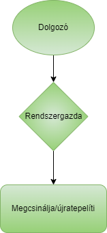

# Követelmény specifikáció

## 1. Áttekintés

Jelenleg a megrendelő cég a számítógépeit védelem nélkül ellátva adja ki a dolgozóknak és gyakran felmerülő probléma hogy a dolgozók beleszaladnak egy-egy vírusba. Ezeknek a vírusoknak a megtalálása és kiírtása feleslegesen sok idő elvesznek a rendszergazdáktól. Arról nem is beszélve, hogy amíg a dolgozónál nincs a laptop, nem tudja a munkát folytatni. Esetenként megtörténik az is, hogy menhetetlen a gép és újra kell telepíteni, így esetleges adatokat veszít a dolgozó, létszükséglet volt a munkájához. Ezen felmerülő problémákat szeretnénk megoldani, illetve megkönnyteni. A megrendelő mindeképpen egy mindenki által könnyen használható felületet szeretne, ami mindenki számára evidens a használata.

## 2. A jelenlegi helyzet leírása

Jelenleg bármilyen probléma van a munkahelyet a számítógépekkel a rendszergazdákhoz fordulnak az emberek, így azok le vannak mindig terhelve. A számítógépek meghibásodása túlnyomó esetekben vírusok miatt keletkezik, mivel eddig semmilyen védelem nem volt a számítógépekre telepítve, ezen vírusokat könnyedén még hozzáértők is könnyen megkaphatták, akár a phishing email-en keresztül. 

## 3. Vágyálomrendszer

A megrendelő olyan felületet szeretne, ami lehetővé teszi egy számítógép teljes diagnosztizálását vírusokat keresve, és az esetleges felmerülő vírusokat kigyomlálni, így nem a rendszergazdákat terheléni ez a feladat is. Jelenleg a számítógépeken semmilyen védelmi eszköz nincs, így kitéve azokat a rengeteg veszélynek ami az interneten terjeng. A telepítéshez rendszergazdai jogosultság kell, azonban a használatához már az átlag felhasználó is hozzáfér. Tud futtatni egy diagnosztikát, ami átfésüli a számítógépet vírusokat keresve. Ha talált, akkor annak elhárításában is segít.

## 4. Jelenlegi üzleti folyamatok modellje

)
