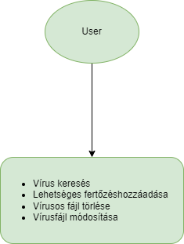

# Rendszerterv
## 1. A rendszer célja

A Top G's nevű csapat elsődleges feladata egy olyan applikáció fejlesztése, ami intuitívan használható, egyszerű megoldást nyújt a számítógépen található károkozók felderítésére és kiírtására. Az alkalmazás feladatai közé tartozik a vírusok diagnosztizálása és azoknak törlése. Szükségünk van egy adatbázisra, ahol az általunk ismert vírusok adatait tároljuk. Alkalmazásunk hasonlóságot, egyezést keres, a már eltárolt vírus adatok és a vizsgálni kívánt mappa között. Ha talált egyezést, akkor felismeri és a felhasználó tudtára adja.

## 2. Projektterv

### 2.1 Projektszerepkörök, felelőségek:
   * Scrum masters: Bagoly Gábor
   * Product owner: Bagoly Gábor
   * Üzleti szereplő: Tajti Tibor

### 2.2 Projektmunkások és felelőségek:
   * Frontend: Kaponya Martin, Szabó Zsolt, Mihály Balázs
   * Backend: Kaponya Martin, Szabó Zsolt, Mihály Balázs
   * Tesztelés: Kaponya Martin, Szabó Zsolt, Mihály Balázs
### 2.3 Ütemterv:

|Funkció                  | Feladat                                | Prioritás | Becslés (nap) | Aktuális becslés (nap) | Eltelt idő (nap) | Becsült idő (nap) |
|-------------------------|----------------------------------------|-----------|---------------|------------------------|------------------|---------------------|
|Követelmény specifikáció |Megírás                                 |         1 |             2 |                      2 |                2 |                   2 |       |Funkcionális specifikáció|Megírás                                 |         1 |             2 |                      2 |                2 |                   2 |
|Rendszerterv             |Megírás                                 |         1 |             2 |                      2 |                2 |                   2 |
|Program                  |Képernyőtervek elkészítése              |         2 |             2 |                      2 |                2 |                   2 | 
|Program                  |Prototípus elkészítése                  |         3 |             17 |                      17 |                17 |                   17 |
|Program                  |Alapfunkciók elkészítése                |         3 |             17 |                      17 |                17 |                   17 |
|Program                  |Tesztelés                               |         4 |             5 |                      5 |                5 |                   5 |

### 2.4 Mérföldkövek:

   * Dokumentációk
   * Programírás kezdete
   * Program alapvető funkcióinak befejezése
   * Fejlesztés befejezése

## 3. Üzleti folyamatok modellje

## 4. Követelmények

| Id | Modul | Név | Leírás |
| :---: | --- | --- | --- |
| K1 | Felület | Search | Vírus keresése, lefutás után státusz visszajelzés. |
| K2 | Felület | Delete | Talált vírus esetén, annak törlése. |
| K3 | Felület | Modify | Vírus hash módosítása esetleges vírusfejlődés esetén. |
| K4 | Felület | Add | Új vírus hozzáadása adatbázisunkhoz. |

  **Nem funkcionális követelmények**

  ***Törvényi előírások, szabványok:***
  - **GDPR-nek való megfelelés**

### Támogatott eszközök

Az alkalmazásunk kompatibilis lesz minden windows rendszerrel ellátott számítógépen.

## 5. Funkcionális terv

### 5.1 Rendszerszereplők

>felhasználó

  **Rendszerhasználati esetek és lefutásaik:**

 - **Felhasználó**
    - **Vírust kereshet**
    - **Vírusos fájl törölhet**
    - **Vírusfájlt módosíthat**
    - **Lehetséges vírusos fájlt adhat hozzá az adatbázishoz**

## 6. Fizikai környezet

- **Az alkalmazás csak .NET-tel rendelkezó platformra készül, C# segítségével, MySQL adatbázissal lesz futtatva.**
  - **Windows 64 bites operációs rendszeren futtatható.**
  - **Fejlesztői eszközök:**
    - **Visual Studio Code**
    - **Notepad++**
    - **XAMPP**
